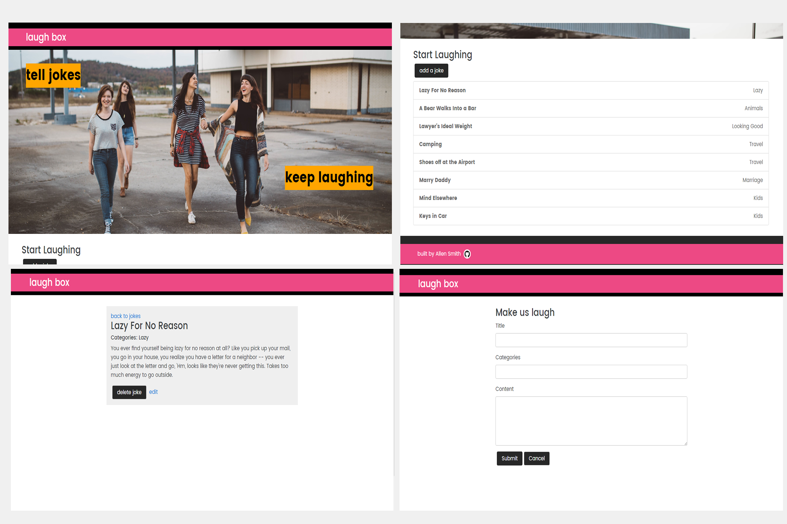

# Laughbox

# About 

> Some say that laughter is the best medicine. So why not make it easier to find something funny? Laugh Box solves this problem. Laugh Box provides a community driven platform that allows users to create jokes that can be seen by others. In addition, users can also edit or delete current jokes.

# Getting Started 

* git clone https://github.com/allen30331/laughbox.git
* cd laughbox
* npm install
* npm install -g react-scripts

## Launch

* npm run start

## Testing 

* npm run test

# App Architecture

# Wireframes

# Technology

## Frontend

* HTML5
* CSS3
* React
* React Router
* Redux
* Axios

## Backend

* Node.js
* MongoDB
* Mocha
* Continuous integration and deployment with Travis CI

# Screenshots

# Attributions 

## Images

* [Pexels](https://www.pexels.com/photo/girls-friends-girlfriends-outdoors-25770/)

* [Behance](https://www.behance.net/gallery/10350581/Creative-Box-Logo-Design)