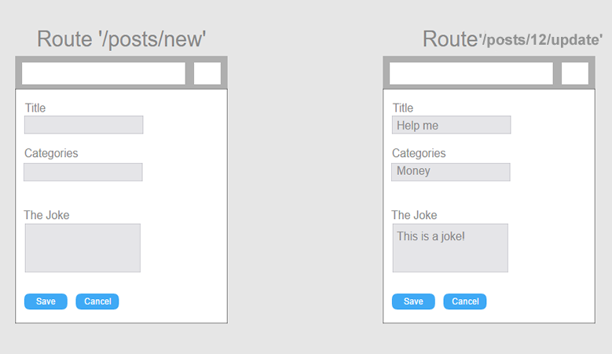

<!-- <h1>Laugh Box</h1>

<a href="https://laughbox.herokuapp.com/" target="_blank">Laugh Box</a> is a an app that allows users to create and share nuggets of laughter.  

<h2>Getting Started</h2>
<ul>
	<li>git clone https://github.com/allen30331/laughbox.git</li>
	<li>cd laughbox</li>
	<li>npm install</li>
	<li>npm install -g react-scripts<li>
</ul>

<h2>Launch</h2>

npm run start

<h2>Test</h2>

npm run test

<h2>Server Instructions</h2>
<ul>
	<li>git clone https://github.com/allen30331/api-laughbox.git</li>
	<li>cd api-laughbox</li>
	<li>npm install</li>
</ul>

<h2>Launch</h2>
<ul>
	<li>npm run dev</li>
	<li>then open localhost:3000 in a web browser</li>
</ul>

<h2>About</h2>

Some say that laughter is the best medicine. So why not make it easier to find something funny? Laugh Box solves this problem. Laugh Box provides a community driven platform that allows users to create jokes that can be seen by others. In addition, users can also edit or delete current jokes.

<h2>Wire Frames</h2>
<ul>
	<li>Initial wire frame for app structure</li>
	<li>Initial wire frame for UX</li>
</ul>

<h2>Technology</h2>
<h3>Front End</h3>
<ul>
	<li>

	## Frontend

	HTML5
CSS3
React
React Router
Redux
Axios</li>
	<li>

	## Frontend

	HTML5
CSS3
React
React Router
Redux
Axios</li>
	<li>

	## Frontend

	HTML5
CSS3
React
React Router
Redux
Axios</li>
	<li>

	## Frontend

	HTML5
CSS3
React
React Router
Redux
Axios</li>
	<li>

	## Frontend

	HTML5
CSS3
React
React Router
Redux
Axios</li>
	<li>

	## Frontend

	HTML5
CSS3
React
React Router
Redux
Axios</li>
</ul>

<h3>Back End</h3>
<ul>
	<li>Node.js + Express.js (web server)</li>
	<li>MongoDB (database)</li>
	<li>Mocha + Chai (testing)</li>
	<li>Continuous integration and deployment with Travis CI</li>
</ul>

<h2>Image Attributions</h2>
<ul>
	<li><a href="https://www.pexels.com/photo/girls-friends-girlfriends-outdoors-25770/">Pexels</a></li>
	<li><a href="https://www.behance.net/gallery/10350581/Creative-Box-Logo-Design">Behance</a></li>
</ul> -->

# Laughbox

# About 

> Some say that laughter is the best medicine. So why not make it easier to find something funny? Laugh Box solves this problem. Laugh Box provides a community driven platform that allows users to create jokes that can be seen by others. In addition, users can also edit or delete current jokes.

# Getting Started 

* git clone https://github.com/allen30331/laughbox.git
* cd laughbox
* npm install
* npm install -g react-scripts

## Launch

* npm run start

## Testing 

* npm run test

# App Architecture

# Wireframes

# Technology

## Frontend

* HTML5
* CSS3
* React
* React Router
* Redux
* Axios

## Backend

* Node.js
* MongoDB
* Mocha
* Continuous integration and deployment with Travis CI

#Screenshots

[screenshot](./public/images/screen-shots.png)

# Attributions 

## Images

* [Pexels](https://www.pexels.com/photo/girls-friends-girlfriends-outdoors-25770/)

* [Behance](https://www.behance.net/gallery/10350581/Creative-Box-Logo-Design)